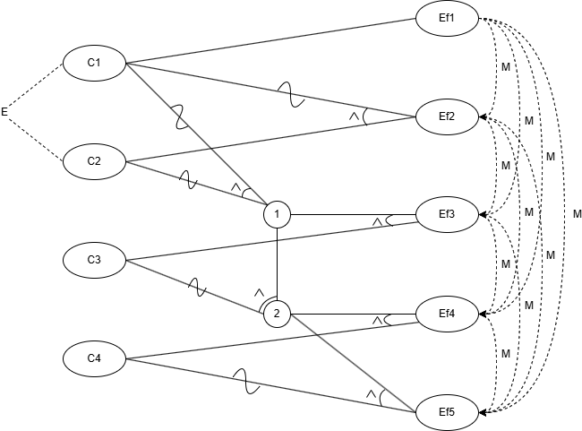

# Url Shortener

Un scurtător de URL-uri simplu care permite utilizatorilor să convertească link-uri lungi în unele mai scurte și mai ușor de gestionat. Serviciul suportă urmărirea accesărilor, date de expirare și gestionarea URL-urilor.

> Cod Echipa: B18

## Software folosit

- Backend: Java 21 + Spring Boot 3.4.0
- Build Tools: Gradle 8.12
- Database: MongoDB 6.0.20
- Testare si code coverage: JUnit 5.11.4 + JaCoCo latest
- IDE: IntelliJ IDEA

## Graful cauza-efect
Cauzele si efectele identificate sunt:
```
C1: Url-ul este null
C2: Url-ul este deja scurtat
C3: Utilizatorul are deja 10 url-uri scurtate
C4: Data expirarii este in trecut

Ef1: IllegalArgumentException: Url must not be empty
Ef2: Returnare url scurt existent
Ef3: TooManyEntriesException
Ef4: IllegalArgumentException: Expiration date must be in the future
Ef5: Creare si returnare url scurt nou
```

Graful cauza-efect:



Tabelul de decizie:


## Clase de echivalenta
Pentru metoda `createShortUrl` din clasa `UrlShortenerService` am identificat urmatoarele clase de echivalenta, bazate pe DTO-ul pasat ca parametru si starea bazei de date din momentul interogarii, pe care le-am grupat impreuna in date de intrare:
1. Domeniul de intrari:
  - U_1 = URL-ul pasat ca parametru este nul
  - U_2 = URL-ul pasat ca parametru este valid si nu se afla deja in baza de date
  - U_3 = URL-ul pasat ca parametru este valid si se afla deja in baza de date
  - D_1 = Data de expirare este in viitor sau nula (in cazul in care este nula, este mai apoi setata automat la o luna in viitor)
  - D_2 = Data de expirare este in trecut
  - C_1 = Utilizatorul are deja 10 sau mai multe URL-uri scurtate
  - C_2 = Utilizatorul are 9 sau mai putine URL-uri scurtate
2. Domeniul de iesiri:
  - E_1 = Exceptie IllegalArgumentException: Url must not be empty
  - E_2 = Exceptie IllegalArgumentException: Expiration date must be in the future
  - E_3 = Exceptie TooManyEntriesException
  - E_4 = returnare URL original pe baza URL-ului scurtat

Combinatii de valori provenite din fiecare clasa de echivalenta au fost folosite pentru a genera teste unitare bazate pe graful cauza-efect.

## Graful flux de control
Graful orientat a fost construit pe baza metodei de mai jos, folosing numerele de linie asa cum apar in captura de ecran. 


Acesta este graful rezultat:


### Acoperire la nivel de ramura

|   | Decizii |
|---|---|
| 1 | originalUrl == null |
| 2 | existingLink.isPresent() |
| 3 | shortUrlRepository.countByCreatorUserId(userId) >= 10 |
| 4 | expiresAt != null && expiresAt.isBefore(LocalDateTime.now())|

## Mutation Testing
Am folosit PIT, integrat prin gradle cu urmatorarea configuratie:
```groovy
pitest {
	junit5PluginVersion = '1.2.2'
	pitestVersion = '1.18.2'
	verbose = true
	targetClasses = ['ro.unibuc.hello.service.UrlShortenerService']
	targetTests = ['ro.unibuc.hello.service.UrlShortenerServiceTest']
	mutators = ['STRONGER']
}
```
Testele cu muntati au fost rulate doar pe clasa UrlShortenerService, unde se afla cea mai mare parte a logicii aplicatiei.

Inainte de modificari, rezultatele rularii testelor PIT au fost urmatoarele:


Cu urmatoarii mutanti care nu au fost descopriti de testele unitare:


Se observa cum pentru linia 45 testul esueaza atunci cand metoda verifica daca utilizatorul a trecut de limita de creare de URL-uri.
Acest mutant nu este descoperit pentru ca nu exista vreun test unitare care sa verifice aceasta ramura a metodei, astfel se adauga urmatorul test:
```java
    @Test
    void testExceededUrlCreationLimit(){
        String testUserId = "testId";
        when(shortUrlRepository.countByCreatorUserId(testUserId)).thenReturn(10);
        UrlRequest urlRequest = new UrlRequest("www.google.com", null);

        TooManyEntriesException exception = assertThrows(TooManyEntriesException.class, () ->
                urlShortenerService.createShortUrl(urlRequest, testUserId));
        assertEquals("The user " + testUserId + " has reached their short url creation limit", exception.getMessage());
    }
```

Pentru linia 49 mutantul nu este descoperit atunci cand schimba conditia "if(expiresAt != null)" cu true, adica nu exista nici un test unitar care sa verifice metoda createShortUrl atunci cand nu este specificata o data de expirare pentru un short URL.
Astfel, se adauga un nou test unitar similar cu cel existent care verifica crearea unui short URL cu o data de expirare specificata de utilizator.
```java
    @Test
    void testCreateNewShortUrlWithoutExpirationDate(){
        String originalUrl = "test.com";
        UrlRequest newUrlRequest = new UrlRequest(originalUrl, null);
        String userId = "abc";
        String generatedShortUrl = "abcdef";
        /*
            Cod identic cu cel din testCreateNewShortUrl
        */
        assertEquals(generatedShortUrl, newShortUrl);
    }
```
De asemenea se observa in raportul generat de PIT cum metodele clasei ShortUrlEntity nu sunt verificate (liniile 55-57 si 61).
Pentru asta se foloseste _verify_ din Mockito pentru ca testele sa poata verifica aplicarea corecta a functiilor marcate cu rosu in raport.
```java
        verify(shortUrlRepository).save(argThat(shortUrlEntity -> {
            assertEquals(originalUrl, shortUrlEntity.getOriginalUrl());
            assertEquals(userId, shortUrlEntity.getCreatorUserId());
            // In cazul testului unitar in care data este specificata se verifica acea data aici
            assertEquals(LocalDate.now().plusMonths(1), shortUrlEntity.getExpirationDate().toLocalDate());
            assertEquals(generatedShortUrl, shortUrlEntity.getShortenedUrl());
            return true;
        }));
```
Dupa aceste modificari, metoda createShortUrl trece toate testele PIT cu o acoperire completa.
Pe langa cele adaugate anterior, s-a mai scris urmatoarea instructiune in interiorul testului testVisitShortenedUrl pentru ca testele PIT sa treaca pentru metoda getOriginalUrl:
```java
    @Test
    void testVisitShortenedUrl() {
        when(shortUrlRepository.findByShortenedUrl(mockShortUrl.getShortenedUrl()))
                .thenReturn(mockShortUrl);
        doNothing().when(tracking).incrementVisits(mockShortUrl.getShortenedUrl());
        String originalUrl = urlShortenerService.getOriginalUrl(mockShortUrl.getShortenedUrl());
        assertEquals(mockShortUrl.getOriginalUrl(), originalUrl);

        verify(tracking, times(1)).incrementVisits(mockShortUrl.getShortenedUrl()); // Noua instructiune
    }
```
Aceasta detecteaza mutantul de pe linia 69 din raport.
In final, se ajunge la urmatorul raport:


## Capturi de ecran
### Acoperirea testelor folosing Intellij

### Rezultatele testelor, generate de Gradle

### Acoperire generata de JaCoCo


## Raport privind folosirea tool-urilor de AI in cadrul proiectului
Vezi [Raport_AI.md](Raport_AI.md)

# Rulare/debug în IntelliJ
* Instalează Java 21
* Setează versiunea JDK a proiectului la 21 (`File > Project Structure > SDK`)
* Compilează codul
  * Se poate folosi și comanda `./gradlew build` pentru a rula testele automat.
* Creează o configurație de rulare în IntelliJ pentru o aplicație Jar
  * Adaugă în configurație calea către fișierul JAR din folderul de build:  
    `./build/libs/hello-0.0.1-SNAPSHOT.jar`
* Pornește containerul MongoDB folosind docker compose: `docker-compose up -d mongo`
* Rulează configurația de rulare din IntelliJ

# Rularea proiectului

* Poți accesa endpoint-urile API la:  
  [http://localhost:8080/](http://localhost:8080/)
* Poți accesa interfața de administrare MongoDB la:  
  [http://localhost:8090/](http://localhost:8090/)

# Rularea testelor

* Adaugă o configurație de test JUnit în IntelliJ, setată să testeze tot din pachetul `hello.test`
