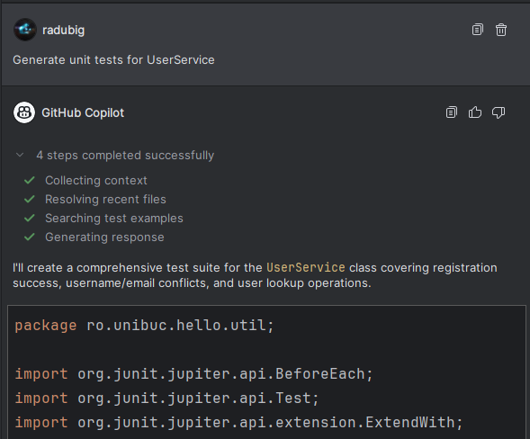
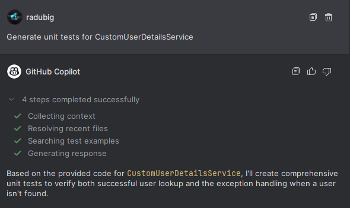
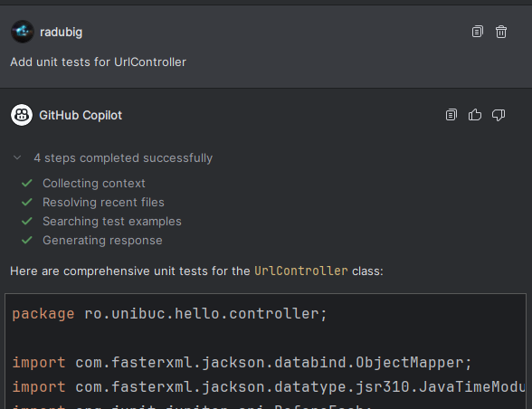
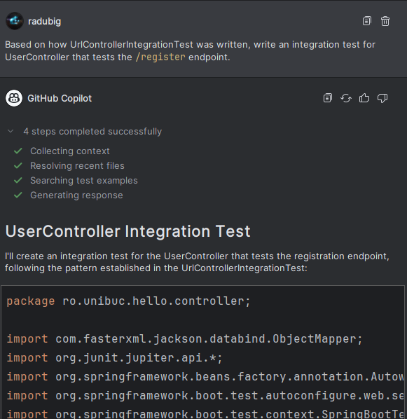

# Raport privind folosirea tool-urilor de AI in cadrul proiectului

Dupa implementarea aplicatiei, am decis ca pentru o parte din teste să folosim AI pentru a le genera. Din experiența anterioară,
am observat că tool-urile de AI sunt foarte utile pentru a genera teste în mod rapid, care să ofere o acoperire cât mai mare a codului
sursă, în special pe funcționalitățile critice ale aplicației. Totodată, aceste tool-uri integrează foarte bine principalele librării de
testare folosite în industrie, în cazul nostru JUnit5 și Mockito pentru aplicațiile Java.

## Tool-uri folosite

Pentru generarea testelor am folosit următorul setup:
- Client AI: [GitHub Copilot](https://github.com/features/copilot) integrat ca extensie în IDE-ul IntelliJ IDEA Ultimate. Am ales această
variantă deoarece extensia de Copilot ofera acces la mai multe modele de AI si ofera posibilitatea de a pasa fisierele considerate
relevante de catre utilizator in context.
- Model AI: Claude 3.7 Sonnet Thinking, dezvoltat de Anthropic.

Exemple de prompt-uri folosite:

Rezultatul acestor prompt-uri a fost direct integrat in cate un fisier corespunzator clasei pe care am testat-o. Datorita modelului
LLM avansat, nu au fost necesare alte modificari pentru functionarea corecta a codului.

In toate aceste prompt-uri am pasat in context fisierele care contineau implementarea serviciilor si a controller-elor pentru care
am generat teste.

## Comparatie cu testele scrise manual

Testele pentru serviciul `UrlShortenerService` au fost scrise manual, iar contextul pentru generarea testelor cu AI a continut
si implementarea manuala a acelor teste. Astfel, am facut urmatoarele observatii:

- Testele generate de AI respecta aceeasi structura de testare ca si cele scrise manual, utilizand aceleasi functii de setup (when) si 
de asertiune (assertEquals, assertThrows, etc.).
- Testele generate de AI au codul mai bine documentat si separat in 3 sectiuni pe fiecare metoda de test: 
  - Arrange: unde se initializeaza variabilele necesare testului
  - Act: unde se apeleaza metoda care urmeaza sa fie testata
  - Assert: unde se verifica rezultatul obtinut in urma apelului metodei
- Toate testele generate de AI sunt functionale si acopera foarte bine codul sursa al serviciilor si controller-elor testate la nivel de
linie.

### Observatie: testele unitare ce exemplificau modalitatile de testare descrise la curs (stuctural testing, functional testing, graful cauza-efect) au fost scrise manual.